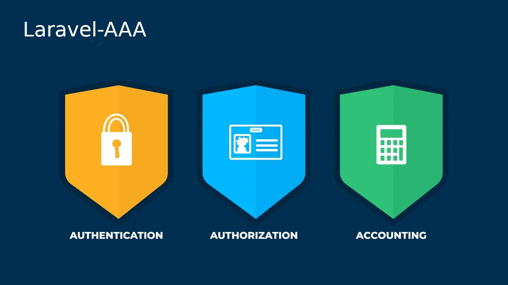

<div align="center">

</div>

<p align="center"><span><b>Laravel-AAA</b>, a customizable and modern package for Authentication + Authorization + Accounting for your laravel project</span></p>
<h4 align="center">
    <span><a href="https://github.com/dnj/laravel-aaa/discussions">Discussions</a></span>
    •
    <span><a href="https://github.com/dnj/laravel-aaa">Documentation</a></span>
</h4>

<div align="center">

[](https://github.com/dnj/laravel-aaa/blob/master/LICENSE)
[](https://github.com/dnj/laravel-aaa/releases)
[](https://github.com/dnj/laravel-aaa/stargazers)
[](https://github.com/dnj/laravel-aaa/network/members)
[](https://github.com/dnj/laravel-aaa/watchers)
[](https://github.com/dnj/laravel-aaa/issues)
[](https://github.com/dnj/laravel-aaa/pulls)
[](https://github.com/dnj)

</div>

---

# What is Laravel-AAA?
Authentication is one of web applications most critical and essential features. Web frameworks like Laravel provide many ways for users to authenticate.\
You can implement Laravel authentication features quickly and securely. However, implementing these authentication features poorly can be risky, as malicious parties can exploit them.\
But, we built a fully customizable package from ground-up to solve this!

Some Laravel-AAA's features in summary are:

-   Secure!
-   Easy to use.
-   Fully customizable.
-   Best practices applied.
-   Latest versions of PHP and PHPUnit
-   Most importantly, It's an Free Open Source Software (FOSS)!

Laravel-AAA is currently under heavy development. You can give your suggestions and feedback on our [Discussions](https://github.com/dnj/laravel-aaa/discussions/) page.

## How to start

First of all, you need a laravel installation, You can start a laravel project by running command:
```bash
composer create-project laravel/laravel my-awesome-laravel-app
```

Or if you already have Laravel, install laravel-aaa in your project by running:
```bash
composer require dnj/laravel-aaa
```

Then, publish configs using this command:
```bash
php artisan vendor:publish --tag=config
```

This will results:
```
INFO  Publishing [config] assets.  

Copying file [vendor/dnj/laravel-aaa/config/aaa.php] to [config/aaa.php] .................................................................... DONE
Copying file [vendor/dnj/laravel-user-logger/config/user-logger.php] to [config/user-logger.php] ............................................ DONE
```

As you see, there are a [aaa.php](https://github.com/dnj/laravel-aaa/blob/master/config/aaa.php) config file that we use it later.


## Concepts

We deal with some concepts, like: `Type`, `TypeAbility`, `TypeLocalizedDetails`, `User` and `Username`

### Type
We define some `Type`s in our app, consider a `Type` is a user level that defines user has access to which fetures of your app.
The `Type` has an id, a localized nameds that can be defined for any languages, maybe a parent, paybe some child, and some abilities.

### TypeAbility
Consider this as a permission for user, each ability is belong to a `Type`.

### User
Each user is has a Type and the Type define that this user has access to which fetures of your app.

### Username
Each user may have some usernames, username can be anything, like: email, cellphone, telegram id, ....


## aaa.php
In this file, you can define the guest type, if user not exists in you app (or not logged in), the app will use this type for check permissions.
define the ID of the guest type in `aaa.php` in `guestType` property.
```php
[
    'guestType' => 2, // The id of guest type
];
```

## Policies
Laravel-AAA provides support for [polices](https://laravel.com/docs/10.x/authorization#creating-policies)
You can define a [polices](https://laravel.com/docs/10.x/authorization#creating-policies) by runnig command:

```bash
php artisan make:policy:aaa
```
Then, add your policies to `AuthServiceProvider`:

```php
<?php

namespace App\Providers;

use Illuminate\Foundation\Support\Providers\AuthServiceProvider as ServiceProvider;
use App\Models\Post;
use App\Policies\PostPolicy;

class AuthServiceProvider extends ServiceProvider
{
    /**
     * The model to policy mappings for the application.
     *
     * @var array<class-string, class-string>
     */
    protected $policies = [
        Post::class => PostPolicy::class,
    ];

    /**
     * Register any authentication / authorization services.
     *
     * @return void
     */
    public function boot()
    {
        $this->registerPolicies();

        ///
    }
}
```
now, you can check permission like this:

```php
<?php

namespace App\Http\Controllers;

use Illuminate\Http\Request;
use Illuminate\Support\Facades\Gate;

class HomeController extends Controller
{
    /**
     * Create a new controller instance.
     *
     * @return void
     */
    public function __construct()
    {
        $this->middleware('auth');
    }

    /**
     * Show the application dashboard.
     *
     * @return \Illuminate\Contracts\Support\Renderable
     */
    public function getPost(Request $request)
    {
        $post = $request->get('post');
        $response = Gate::inspect('view_post_permission', $post);
        if ($response) {
            // allow
        } else {
            // deny
        }
        return view('view_post', ['title' => $post->getTitle()]);
    }
}

```

## Type Managment
The `ITypeManager` interface provides methods for creating, updating, and deleting types, Here's an example of how to create a new type:

```php
use dnj\AAA\Contracts\ITypeManager;
use dnj\AAA\Contracts\IType;


class TypeController extends Controller
{
    private $typeManager;

    public function __construct(ITypeManager $typeManager)
    {
        $this->typeManager = $typeManager;
    }

    public function createType()
    {
        // the name of this type in diffrent languages
        $localizedDetails = [
            'en' => ['title' => 'Admin'],
            'fr' => ['title' => 'Administratrice'],
            'nl' => ['title' => 'beheerder'],
        ];

        // abilities that we want to define for this type (user role)
        $abilities = [
            'add_post',
            'edit_post',
            'remove_post',
            'publish_post',
        ]

        // the subtype IDs, consider this type as parent of other types, that means this type will have permission to another types
        $childIds = [
            // id
        ];

        // if you want to define any other data for this type, use this field
        $meta = [
            'notes' => 'Some notes about this type',
        ];

        // save log for this action
        $userActivityLog = true;

        $type = $this->typeManager->create($localizedDetails, $abilities, $childIds, $meta, $userActivityLog);
    }

    public function updateType(IType $type, array $update)
    {
        $changes = [];

        if (isset($update['localizedDetails'])) {
            $changes['localizedDetails'] = $update['localizedDetails'];
        }
        if (isset($update['abilities'])) {
            $changes['abilities'] = $update['abilities'];
        }
        if (isset($update['childIds'])) {
            $changes['childIds'] = $update['childIds'];
        }
        if (isset($update['meta'])) {
            $changes['meta'] = $update['meta'];
        }
        // save log for this action
        $userActivityLog = true;

        $type = $this->typeManager->create($type, $changes, $userActivityLog);
    }

    public function deleteType(IType $type)
    {
        // save log for this action
        $userActivityLog = true;

        $this->typeManager->delete($type, $userActivityLog);
    }
}
```


## User Managment
The `IUserManager` interface provides methods for creating, updating, and deleting users, Here's an example of how to create a new user:

```php
use dnj\AAA\Contracts\IUserManager;
use dnj\AAA\Contracts\IUser;
use dnj\AAA\Contracts\ITypeManager;
use dnj\AAA\Contracts\IType;

class UserController extends Controller
{
    private $userManager;

    public function __construct(IUserManager $userManager)
    {
        $this->userManager = $userManager;
    }

    public function createUser()
    {
        // name of the user
        $name = 'Hossein Hosni'

        // username of the user
        $username = 'hosni'; // or cellphone number, or any unique thing

        // password of the user
        $password = 'SomeStrongPassword@123';

        // the id of the user, or the Type object
        $type = 1;
        // or create user as guest
        $type = app(ITypeManager::class)->getGuestTypeID();

        // if you want to define any other data for this user, use this field
        $meta = [
            'notes' => 'Some notes about this user',
        ];

        // save log for this action
        $userActivityLog = true;

        $user = $this->userManager->create($name, $username, $type, $meta, $userActivityLog);
    }

    public function updateUser(IUser $user, array $update)
    {
        $changes = [];

        if (isset($update['type'])) {
            $changes['type'] = $update['type'];
        }
        if (isset($update['usernames'])) {
            $changes['usernames'] = $update['usernames'];
        }
        // save log for this action
        $userActivityLog = true;

        $user = $this->userManager->create($user, $changes, $userActivityLog);
    }

    public function deleteUser(IUser $user)
    {
        // save log for this action
        $userActivityLog = true;

        $this->userManager->delete($user, $userActivityLog);
    }
}
```


## Bug Reporting

If you find any bugs, please report it by submitting an issue on our [issue page](https://github.com/dnj/laravel-aaa/issues) with a detailed explanation. Giving some screenshots would also be very helpful.

## Feature Request

You can also submit a feature request on our [issue page](https://github.com/dnj/laravel-aaa) or [discussions](https://github.com/dnj/laravel-aaa/discussions) and we will try to implement it as soon as possible. If you want to contribute to this project, please [contribute to this project](https://github.com/dnj/laravel-aaa#Development).


## Development

If you want to run this project in your local system, please follow this guide:

1. Fork this project

2. Clone the project to your local system using this command

```sh
$ git clone https://github.com/<your_github_username>/laravel-aaa.git
```

3. Change directory to the root directory of this project

```sh
$ cd laravel-aaa
```

4. Install all dependencies using [`composer`](https://getcomposer.org/)

```sh
$ composer install
```

5. Run the project in development mode. 
